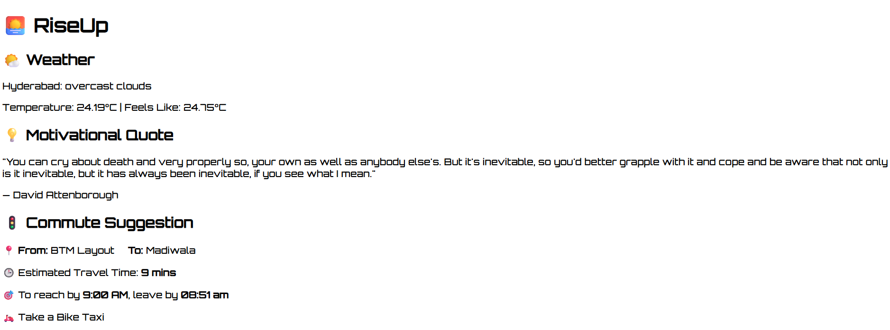

# 🌅 RiseUp

**RiseUp** is a futuristic daily companion web application designed to give users a powerful and positive start to their day. Built during Call2Code 2025, this app integrates multiple public APIs to deliver personalized, real-time, and helpful information every morning.

## 💡 Inspiration

We often start our day in a rush or without direction. **RiseUp** aims to transform that by becoming your morning dashboard — helping you feel motivated, informed, and prepared before stepping out.

---

## 🚀 Features Implemented

| Feature | Difficulty | Description |
|--------|------------|-------------|
| Weather Update | Easy | Real-time weather based on user's city using OpenWeatherMap API. |
| Motivational Quote | Easy | Fetches a motivational quote to inspire the user. |
| Daily Task / AIM | Medium | Suggests a small but meaningful aim for the day (e.g., “Learn something new”). |
| News Headlines | Medium | Displays the top 4 news headlines using NewsAPI. |
| Exercise Suggestion | Medium | Gives a short workout/exercise suggestion to stay active. |
| Commute Planner | Hard | Calculates travel time from home (BTM Layout) to office (Madiwala), suggests when to leave and mode of transport. |

---

## 🔗 APIs Used

1. **OpenWeatherMap API**  
   → Real-time weather updates based on city.

2. **Quotable API**  
   → Motivational quotes for daily inspiration.

3. **BoredAPI (Daily Aim)**  
   → Suggests daily task/activity to keep users productive.

4. **NewsAPI**  
   → Fetches current top news headlines.

5. **Wger API (Exercise)**  
   → Suggests random exercises with difficulty and equipment info.

6. **OpenRouteService API**  
   → Calculates commute time and suggests when to leave & mode of transport.

---

## 🌐 Live Preview

_Not deployed yet. Hosted version will be provided in the final round._

---

## 📁 Folder Structure

src/
├── components/
│ ├── Greeting.js
│ ├── Weather.js
│ ├── Quote.js
│ ├── DailyTask.js
│ ├── News.js
│ ├── Exercise.js
│ └── Commute.js
├── App.js
├── index.js
└── styles/
└── index.css
## 📸 Screenshots

---
🧠 Developed During
Call2Code 2025 Hackathon
A solo submission by Akuthota Rakesh Kumar
